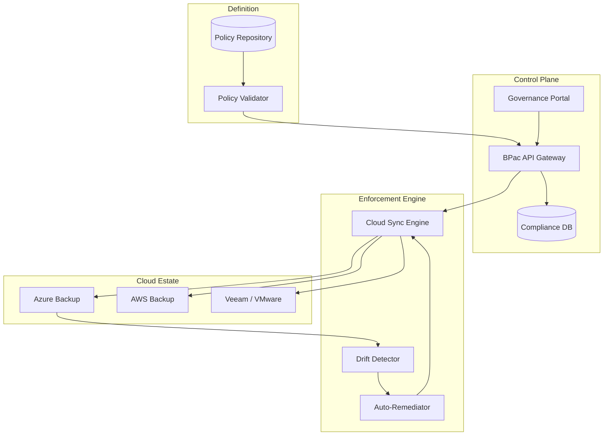
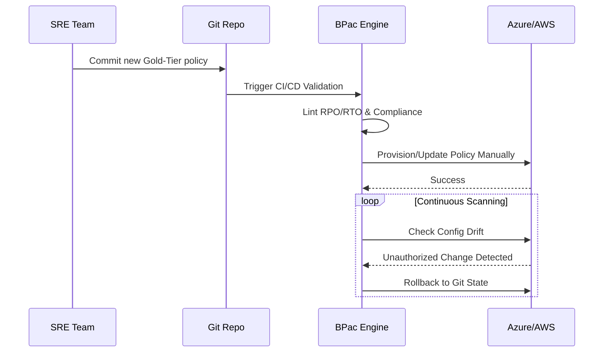
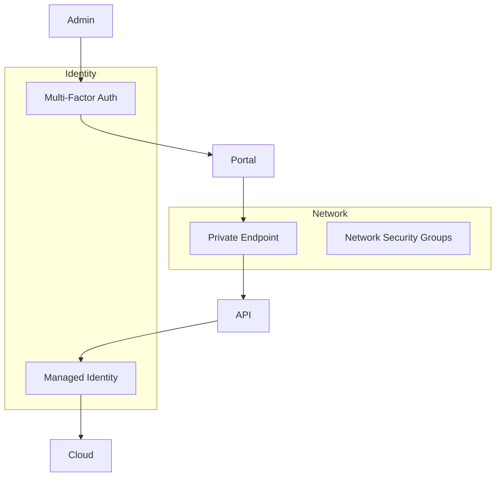

<div align="center">


<h1>Backup Policy as Code (BPac)</h1>

<p><strong>The Enterprise Standard for Global Backup Governance, Automated Compliance, and Continuous Enforcement</strong></p>

[]()
[]()
[]()
[]()

<br/>

> **"Infrastructure without policy is just chaos waiting to happen."** 
> Backup Policy as Code (BPac) is an institutional-grade governance engine that defines, deploys, and continuously enforces backup RPO/RTO standards across multi-cloud estates using standard YAML manifests and automated drift remediation.

</div>

---

## 📋 Executive Summary

**Backup Policy as Code (BPac)** enables organizations to manage their data protection strategy exactly like their software. By shifting from manual vault configuration to a declarative "Policy-as-Code" model, BPac ensures that every server, database, and container in the enterprise is protected according to its mandated business criticality tier.

### 🚀 Strategic Business Outcomes
- **Eliminate Compliance Gaps**: Automatically detect and remediate resources that are missing backup protection (Zero-Day Discovery).
- **Enforce RPO/RTO**: Guarantee that "Platinum" workloads are meeting 15-minute RPO mandates via automated policy templates.
- **Ransomware Immunity**: Centrally enforce "Immutability Locks" (WORM) and multi-user authentication (MUA) for all critical vaults.
- **Institutional Scale**: Manage 100,000+ assets across 50+ regions from a single Git repository.

---

## 🏛️ High-Level Architecture

BPac utilizes a "GitOps for Backups" pattern to maintain the desired state of the global protection estate.



### 💉 The Enforcement Lifecycle



---

## 📐 Policy Governance Pillars

| Pillar | Solution Component | Outcome |
|:---|:---|:---|
| **Declarative** | YAML Manifests | Human-readable, version-controlled rules |
| **Immutable** | Vault Locks | Protection against malicious deletions |
| **Corrective** | Drift Remediation | 24/7 enforcement of desired state |
| **Auditable** | Evidence Exports | One-click SOC2/ISO audit response |

---

## 📂 Repository Structure

```text
backup-policy-as-code/
├── apps/
│   ├── portal/             # Governance Analytics Dashboard
│   ├── api/                # BPac Core Gateway
│   ├── policy-engine/      # YAML compiler & logic
│   ├── compliance-engine/  # Continuous auditor
│   └── drift-engine/       # Real-time config watcher
├── policy-packs/           # Reusable Gold/Silver/Bronze tiers
├── templates/              # Vendor-specific policy generators
├── database/               # PostgreSQL governance schema
├── terraform/              # Enterprise Infrastructure
├── .github/workflows/      # Policy validation pipelines
└── README.md               # Flagship Product Documentation
```

---

## 🚀 Deployment Guide

### 1. Register Policy Packs
Initialize your enterprise standards by pushing the reference packs to the BPac API.

```bash
# Push Gold tier definitions
curl -X POST https://api.bpac.enterprise/v1/policies/packs \
     -d @policy-packs/gold-tier/full-pack.yaml
```

### 2. Enable Auto-Remediation
Turn on the active enforcement engine to prevent drift.

```bash
export BPAC_EMFORCEMENT_MODE="ACTIVE"
./scripts/start-drift-daemon.sh
```

---

## 🛡️ Security Trust Boundary



- **Vault Separation**: Dedicated management Plane separate from Data Plane.
- **MUA Enforcement**: High-risk operations (e.g., policy deletion) require 2-person approval.
- **Audit Logging**: Mandatory immutable logging of all policy change requests.

---

## 🤝 Support & Roadmap
- **Policy Support**: support@devopstrio.com
- **Enterprise Status**: [Status Page](https://status.devopstrio.com)

<div align="center">


**Building the future of enterprise infrastructure — one blueprint at a time.**

</div>
