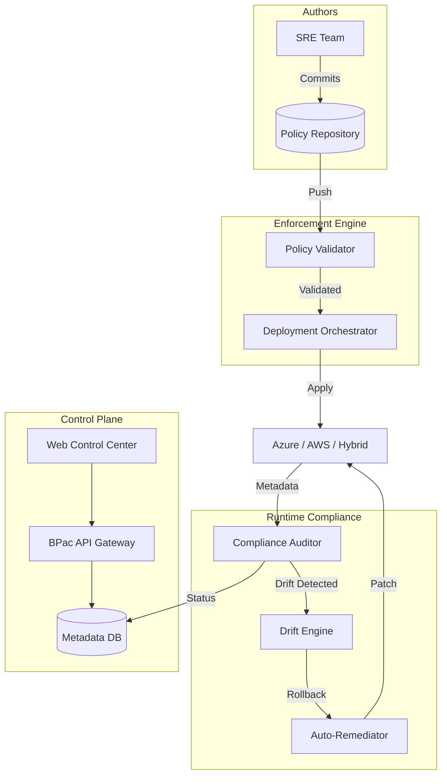

# 🛡️ Backup Policy as Code (BPac)

[]()
[]()

---

## 🏛️ Architecture Overview

BPac provides an automated feedback loop for enterprise backup governance.



## 🚀 Deployment Guide

### 1. Provision Infrastructure
BPac requires a secure Kubernetes foundation.

```bash
cd terraform
terraform init
terraform apply -auto-approve
```

### 2. Initialize Policy Packs
Load the default Gold/Silver/Bronze packs into the platform.

```bash
# Push first policy pack to the API
curl -X POST https://api.bpac.enterprise/v1/policies/packs \
     -H "Content-Type: application/yaml" \
     --data-binary "@policy-packs/gold-tier/pack.yaml"
```

## 🧪 Enforcement Lifecycle

1.  **Define**: Rules are written in YAML (e.g., `daily-backup.yaml`).
2.  **Lint**: CI/CD validates policy logic and RPO limits.
3.  **Assign**: Resources are linked to policies via tags or API bindings.
4.  **Audit**: Continuous engine checks encryption and retention.
5.  **Remediate**: Unauthorized changes are automatically reverted.

---

## 🔐 Security Standards
- **mTLS Everywhere**: Internal engine communication is strictly encrypted.
- **Approval Chains**: Policy changes > 1y retention require CAB approval.
- **Immutable State**: Policy versions are immutable once hashes are locked.

## 🤝 Support
- Enterprise Support: support@devopstrio.com
- Internal Slack: #platform-bca-governance
